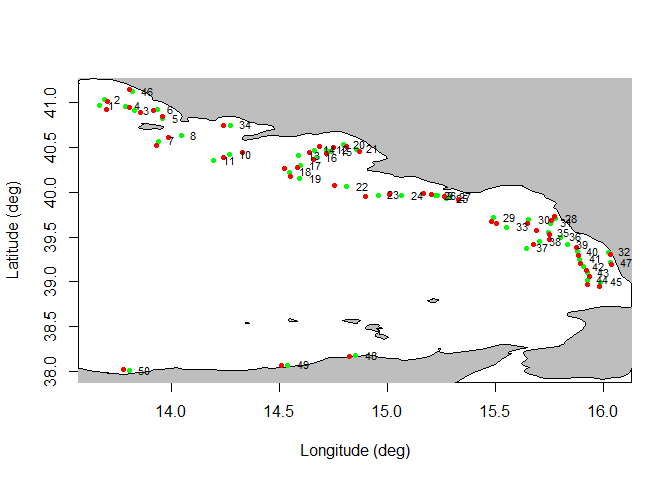
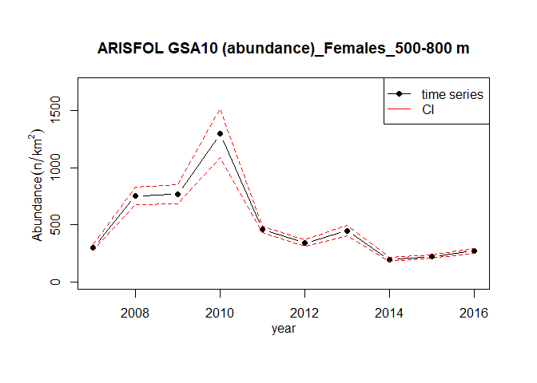
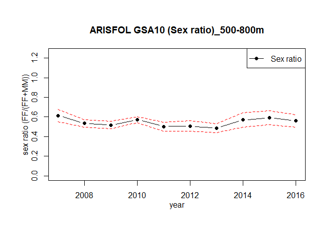
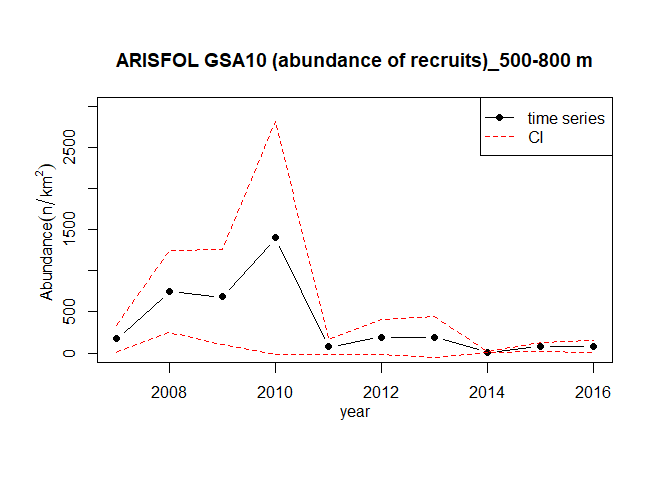
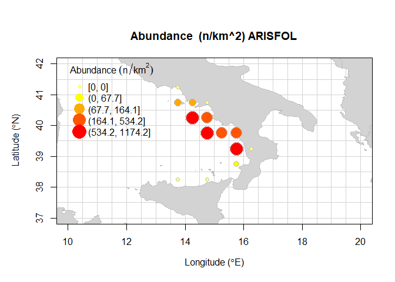
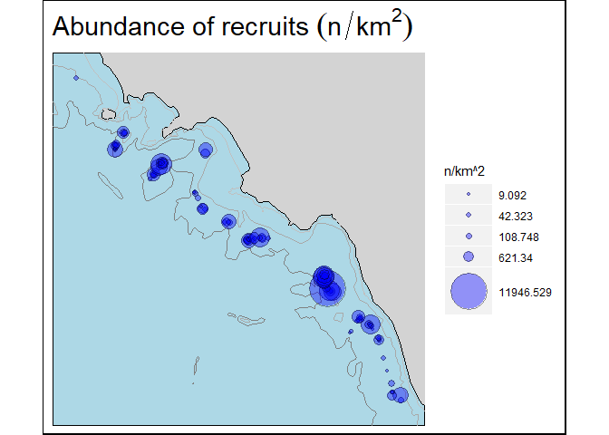
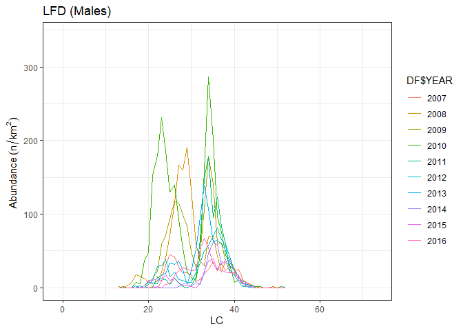

<!-- README.md is generated from README.Rmd. Please edit that file -->

# MEDITS

<!-- badges: start -->

<!-- badges: end -->

The MEDITS packages was realized to work with survey data in the format
of the MEDITS project. The package uses TA-, TB-, and TC-like tables.
Functions using TE and TL table are not already implemented. TA table
contains hauls’ information; TB contains catch data; TC contains
aggregated biological data. Examples of TA, TB and TC table were added
to the package in order to execute the example codes.

## Installation

You can install the released version of MEDITS from
[CRAN](https://CRAN.R-project.org) with:

``` r
install.packages("MEDITS")
```

## Working with coordinates (TA file)

The MEDITS format uses a specific format for the geographic coordinates.
Two functions were introduced to convert the coordinates respectively
from the MEDITs format to decimal degrees format and viceversa.

``` r
# Coordinates conversion from MEDITS format to decimal degrees
library(MEDITS)
dd <- MEDITS.to.dd(TA)
head(dd)
#>   TYPE_OF_FILE COUNTRY AREA VESSEL  GEAR RIGGING DOORS YEAR MONTH DAY
#> 1           TA     ITA   10    PEC GOC73    GC73  WHS8 2007     8  11
#> 2           TA     ITA   10    PEC GOC73    GC73  WHS8 2007     8  11
#> 3           TA     ITA   10    PEC GOC73    GC73  WHS8 2007     8  11
#> 4           TA     ITA   10    PEC GOC73    GC73  WHS8 2007     8  11
#> 5           TA     ITA   10    PEC GOC73    GC73  WHS8 2007     8  11
#> 6           TA     ITA   10    PEC GOC73    GC73  WHS8 2007     8  11
#>   HAUL_NUMBER CODEND_CLOSING PART_OF_THE_CODEND SHOOTING_TIME
#> 1           1              S                  S          1114
#> 2           2              S                  S           948
#> 3           3              S                  S          1500
#> 4           4              S                  S          1355
#> 5           5              S                  S           502
#> 6           6              S                  S           615
#>   SHOOTING_QUADRANT SHOOTING_LATITUDE SHOOTING_LONGITUDE SHOOTING_DEPTH
#> 1                 1          40.96233           13.66683            376
#> 2                 1          41.03167           13.69167            109
#> 3                 1          40.90900           13.82950            113
#> 4                 1          40.95750           13.78783             95
#> 5                 1          40.81617           13.96200             77
#> 6                 1          40.91733           13.93683             25
#>   HAULING_TIME HAULING_QUADRANT HAULING_LATITUDE HAULING_LONGITUDE
#> 1         1214                1         40.92067          13.70017
#> 2         1018                1         41.01117          13.70483
#> 3         1530                1         40.88800          13.85900
#> 4         1425                1         40.94050          13.80650
#> 5          532                1         40.83967          13.95783
#> 6          645                1         40.90317          13.91733
#>   HAULING_DEPTH HAUL_DURATION VALIDITY COURSE RECORDED_SPECIES DISTANCE
#> 1           331            60        V      R                3     5500
#> 2           112            30        V      R                3     2593
#> 3           119            30        V      R                3     2926
#> 4            97            30        V      R                3     2500
#> 5            75            30        V      R                3     2759
#> 6            23            30        V      R                3     2630
#>   VERTICAL_OPENING WING_OPENING GEOMETRICAL_PRECISION BRIDLES_LENGTH
#> 1               19          191                     E            150
#> 2               19          182                     E            100
#> 3               19          182                     E            100
#> 4               19          182                     E            100
#> 5               19          182                     E            100
#> 6               19          163                     E            100
#>   WARP_LENGTH WARP_DIAMETER HYDROLOGICAL_STATION OBSERVATIONS
#> 1        1300            14                    0            0
#> 2         550            14                    0            0
#> 3         550            14                    0            0
#> 4         550            14                    0            0
#> 5         450            14                    0            0
#> 6         300            14                    0            0
#>   BOTTOM_TEMPERATURE_BEGINNING BOTTOM_TEMPERATURE_END MEASURING_SYSTEM
#> 1                         14.0                   14.0               VA
#> 2                         14.3                   14.2               VA
#> 3                         14.3                   14.0               VA
#> 4                         14.6                   14.3               VA
#> 5                         14.9                   14.9               VA
#> 6                         18.1                   18.6               VA
#>   NUMBER_OF_THE_STRATUM BOTTOM_SALINITY_BEGINNING BOTTOM_SALINITY_END
#> 1                 13404                        NA                  NA
#> 2                 13403                        NA                  NA
#> 3                 13403                        NA                  NA
#> 4                 13402                        NA                  NA
#> 5                 13402                        NA                  NA
#> 6                 13401                        NA                  NA
#>   MEASURING_SYSTEM_SALINITY
#> 1                        NA
#> 2                        NA
#> 3                        NA
#> 4                        NA
#> 5                        NA
#> 6                        NA

# Coordinates conversion from decimal degrees to MEDITS format
med <- dd.to.MEDITS(dd)
head(med)
#>   TYPE_OF_FILE COUNTRY AREA VESSEL  GEAR RIGGING DOORS YEAR MONTH DAY
#> 1           TA     ITA   10    PEC GOC73    GC73  WHS8 2007     8  11
#> 2           TA     ITA   10    PEC GOC73    GC73  WHS8 2007     8  11
#> 3           TA     ITA   10    PEC GOC73    GC73  WHS8 2007     8  11
#> 4           TA     ITA   10    PEC GOC73    GC73  WHS8 2007     8  11
#> 5           TA     ITA   10    PEC GOC73    GC73  WHS8 2007     8  11
#> 6           TA     ITA   10    PEC GOC73    GC73  WHS8 2007     8  11
#>   HAUL_NUMBER CODEND_CLOSING PART_OF_THE_CODEND SHOOTING_TIME
#> 1           1              S                  S          1114
#> 2           2              S                  S           948
#> 3           3              S                  S          1500
#> 4           4              S                  S          1355
#> 5           5              S                  S           502
#> 6           6              S                  S           615
#>   SHOOTING_QUADRANT SHOOTING_LATITUDE SHOOTING_LONGITUDE SHOOTING_DEPTH
#> 1                 1           4057.74            1340.01            376
#> 2                 1           4101.90            1341.50            109
#> 3                 1           4054.54            1349.77            113
#> 4                 1           4057.45            1347.27             95
#> 5                 1           4048.97            1357.72             77
#> 6                 1           4055.04            1356.21             25
#>   HAULING_TIME HAULING_QUADRANT HAULING_LATITUDE HAULING_LONGITUDE
#> 1         1214                1          4055.24           1342.01
#> 2         1018                1          4100.67           1342.29
#> 3         1530                1          4053.28           1351.54
#> 4         1425                1          4056.43           1348.39
#> 5          532                1          4050.38           1357.47
#> 6          645                1          4054.19           1355.04
#>   HAULING_DEPTH HAUL_DURATION VALIDITY COURSE RECORDED_SPECIES DISTANCE
#> 1           331            60        V      R                3     5500
#> 2           112            30        V      R                3     2593
#> 3           119            30        V      R                3     2926
#> 4            97            30        V      R                3     2500
#> 5            75            30        V      R                3     2759
#> 6            23            30        V      R                3     2630
#>   VERTICAL_OPENING WING_OPENING GEOMETRICAL_PRECISION BRIDLES_LENGTH
#> 1               19          191                     E            150
#> 2               19          182                     E            100
#> 3               19          182                     E            100
#> 4               19          182                     E            100
#> 5               19          182                     E            100
#> 6               19          163                     E            100
#>   WARP_LENGTH WARP_DIAMETER HYDROLOGICAL_STATION OBSERVATIONS
#> 1        1300            14                    0            0
#> 2         550            14                    0            0
#> 3         550            14                    0            0
#> 4         550            14                    0            0
#> 5         450            14                    0            0
#> 6         300            14                    0            0
#>   BOTTOM_TEMPERATURE_BEGINNING BOTTOM_TEMPERATURE_END MEASURING_SYSTEM
#> 1                         14.0                   14.0               VA
#> 2                         14.3                   14.2               VA
#> 3                         14.3                   14.0               VA
#> 4                         14.6                   14.3               VA
#> 5                         14.9                   14.9               VA
#> 6                         18.1                   18.6               VA
#>   NUMBER_OF_THE_STRATUM BOTTOM_SALINITY_BEGINNING BOTTOM_SALINITY_END
#> 1                 13404                        NA                  NA
#> 2                 13403                        NA                  NA
#> 3                 13403                        NA                  NA
#> 4                 13402                        NA                  NA
#> 5                 13402                        NA                  NA
#> 6                 13401                        NA                  NA
#>   MEASURING_SYSTEM_SALINITY
#> 1                        NA
#> 2                        NA
#> 3                        NA
#> 4                        NA
#> 5                        NA
#> 6                        NA
```

Two functions were also introduced to estimate the hauls distance using
respectivelly MEDITS coordinates and decimal degrees coordinates:

``` r
library(MEDITS)
# distance estimation using MEDITS coordinates
med.dist <- MEDITS.distance(TA, unit="km", verbose=TRUE)
#> kilometers
head(med.dist)
#> [1] 5.409739 2.531317 3.403627 2.454159 2.634717 2.271499

# distance estimation using decimal degrees coordinates
dd <- MEDITS.to.dd(TA)
dd.dist <- dd.distance(dd, unit="km", verbose=TRUE)
#> kilometers
head(dd.dist)
#> [1] 5.409739 2.531317 3.403627 2.454159 2.634717 2.271499
```

The function *land.points* allows to check whether some of the TA
table’s coordinates fall on the land:

``` r
land.points(TA)
#> 
#> None of the coordinates falls on the land
#> [1] NA
```

A plot of haul’s positions could also be generated, with the possibility
to define the years range to be considered, the GSA area and, whether
both initial and end coordinates should be plotted or only the mean haul
coordinates:

``` r
haul.plot(TA, GSA = 10, year = c(2007), type = "b", labels = TRUE)
```



## Working with TB and TC files

To link the geographic information of the hauls respectively to catch
and biological data were introduced two different functions: *m.TATB*
and *m.TATC*:

``` r
# merge of TA and TB tables
mTATB <- m.TATB(TA,TB,"ARISFOL")

# merge of TA and TB tables
mTATC <- m.TATC(TA,TC,"ARISFOL")
```

The estimation of the indices’ time series is performed by the
*index.ts* function. It is possible to estimate the following indices:
abundance, inverse of abundance CV, biomass and mean individual weight
(MIW). The analysis could also be performed by sex.

``` r
merge_TATB <- m.TATB(TA,TB,"ARISFOL")
ind <- index.ts(merge_TATB, index="abundance", depth_range = c(500,800), sex="f",
str.scheme=strata_scheme, surf=stratification_scheme)
```



The function *sexratio.ts* estimates the time series of the sex ratio:

``` r
ind <- m.TATB(TA,TB,"ARISFOL")
sexratio.ts(merge = ind, GSA = NA, sspp = NA, depth_range=c(500,800),
strata_scheme=strata_scheme, stratification=stratification_scheme, plot=TRUE )
```



    #>    year Indices_F Indices_FM sex.ratio     variance         sd
    #> 1  2007  299.2558   486.8133 0.6147239 0.0009996861 0.03161781
    #> 2  2008  752.4499  1408.3255 0.5342869 0.0003541958 0.01882009
    #> 3  2009  767.4742  1481.7511 0.5179508 0.0003372210 0.01836358
    #> 4  2010 1299.4429  2274.6234 0.5712783 0.0002175715 0.01475031
    #> 5  2011  457.9915   911.2554 0.5025940 0.0005486862 0.02342405
    #> 6  2012  338.1038   667.3721 0.5066196 0.0007491415 0.02737045
    #> 7  2013  446.7506   921.2462 0.4849416 0.0005424969 0.02329156
    #> 8  2014  193.2033   339.2838 0.5694444 0.0014594096 0.03820222
    #> 9  2015  222.5422   375.6135 0.5924765 0.0013081896 0.03616890
    #> 10 2016  270.0096   481.6231 0.5606242 0.0010304969 0.03210135
    #>    positive_hauls_perc
    #> 1                  100
    #> 2                  100
    #> 3                  100
    #> 4                  100
    #> 5                  100
    #> 6                  100
    #> 7                  100
    #> 8                  100
    #> 9                  100
    #> 10                 100

The function *index.rs* allows to estimate the time series of abundance
index for both recruits and spawners:

``` r
index.rs (TA,TB,TC,GSA=10,sspp="ARISFOL",stage ="recruits",cutoff=29,
  depth_range=c(500,800),str.scheme=strata_scheme,
  surf=stratification_scheme,plot=TRUE)
```



    #>    year   abundance         sd
    #> 1  2007  173.819218  85.441493
    #> 2  2008  746.525103 253.963668
    #> 3  2009  682.000011 295.301758
    #> 4  2010 1399.952318 724.374171
    #> 5  2011   73.869603  44.097009
    #> 6  2012  193.791201 106.736291
    #> 7  2013  194.214778 125.944553
    #> 8  2014    7.068412   3.177105
    #> 9  2015   75.946935  28.093725
    #> 10 2016   77.475985  38.404432

## Spatial analysis

Placing the above described indices in the spatial dimension is very
useful for several objectives, as the knowledge of the distribution and
abundance of the species at local and regional spatial scale, the
identification of areas with certain peculiarities, the localization of
sensitive life stage of the population, etc… GFCM grid is considered as
the better available trade-off for the spatial scale to be used in the
different steps of the analysis, especially considering the subsequent
possible overlap with maps of the fishing effort spatial distribution.
This despite the fact that not any unit in the grid can actually
encompass the spatial distribution of all the life stages of a given
species, especially when this distribution is depth related. To perform
the spatial analysis of the indicators it is needed to assign the haul
information to the relative cells of the GFCM statistical grid contained
in *cgpmgrid* variable as *SpatialPolygonsDataFrame*. The functions
*TATB.grid* and *TATC.grid* were generated with this purpose:

``` r
# overlap of TATB with the grid
gTATB <- TATB.grid(TA,TB,"ARISFOL")

# overlap of TATC with the grid
gTATC <- TATC.grid(TA,TC,"ARISFOL")
```

The estimation of the indices over the statistical grid is performed by
the function
*sp.index*:

``` r
sp.index(TA,TB,sspp="ARISFOL",type="abundance",range <- c(10, 20, 37, 42))
```



    #>    cgpmgridlevel GSA   meanNkm2    sdNkm2    cvNkm2 inverse_cvNkm2 nhauls
    #> 1           5091  10    0.00000    0.0000       NaN            NaN     20
    #> 2           5227  10   99.99893  329.7339 3.2973739      0.3032716     60
    #> 3           5228  10   81.62708  230.6419 2.8255557      0.3539127     20
    #> 4           5229  10    0.00000    0.0000       NaN            NaN     11
    #> 5           5364  10 1174.22674 1190.8150 1.0141270      0.9860698     20
    #> 6           5365  10  180.12146  421.2692 2.3388063      0.4275685     99
    #> 7           5501  10 1140.74609  928.8783 0.8142726      1.2280899     10
    #> 8           5502  10  433.82575 1009.3968 2.3267333      0.4297871     57
    #> 9           5503  10  479.51507 1678.8692 3.5011814      0.2856179     63
    #> 10          5639  10  616.35084  626.4636 1.0164075      0.9838574     83
    #> 11          5640  10    0.00000    0.0000       NaN            NaN     20
    #> 12          5775  10   64.19004  121.4411 1.8919000      0.5285692      7
    #> 13          5907  10    0.00000    0.0000       NaN            NaN     10
    #> 14          5909  10    0.00000    0.0000       NaN            NaN     20
    #>    positive_hauls   lon   lat
    #> 1               0 13.75 41.25
    #> 2              11 13.75 40.75
    #> 3               4 14.25 40.75
    #> 4               0 14.75 40.75
    #> 5              20 14.25 40.25
    #> 6              27 14.75 40.25
    #> 7              10 14.75 39.75
    #> 8              17 15.25 39.75
    #> 9              13 15.75 39.75
    #> 10             81 15.75 39.25
    #> 11              0 16.25 39.25
    #> 12              2 15.75 38.75
    #> 13              0 13.75 38.25
    #> 14              0 14.75 38.25

Furthermore, the function *bubble.rs*, using TA, TB, and TC tables
estimates the abundance indices per hauls for recruits and spawners
specimens. Recruits and spawners specimens are selected using the cutoff
parameter defined by the user. Bathymetrical lines refers respectively
to 50m, 200m, and 800m of
depth.

``` r
bubble.rs(TA, TB, TC, GSA = 10, "ARISFOL", stage ="recruits", cutoff = 29)
```



## q<sup>th</sup> percentile of the LFD

The different percentiles of a length frequency distribution (LFD) are
expected to respond differently to fishing, recruitment pulses, and loss
of spawning stock. It is assumed to be negatively (decrease) affected by
an excessive fishing pressure.

Length frequency distribution (LFD) is computed by the *LFD* function,
while the Lq is estimated by *quant* function:

``` r
merge_TATB <-  m.TATB(TA,TB,"ARISFOL")
merge_TATC <-  m.TATC(TA,TC,"ARISFOL")
indices <- index.ts(merge_TATB,GSA = 10 ,"ARISFOL",index = "abundance",
depth_range=c(500,800), str.scheme=strata_scheme,
surf=stratification_scheme, sampling = "RSS",plot=FALSE)
freq <- LFD(merge_TATC,indices,sex="m",LC=1,depth_range=c(500,800), type = "indices")
```



``` r

quant(freq,0.95)
#>             2007  2008  2009  2010  2011  2012  2013  2014  2015  2016
#> percentile 40.90 37.80 38.70 36.90 39.00 38.80 39.30 40.30 40.60 40.10
#> Variance    0.04  0.14  0.05  0.01  0.02  0.01  0.03  0.05  0.04  0.06
```

## Analysis of temporal trends

In presence of a short trawl survey time series the significance of the
trend can be estimated using nonparametric statistical tests as Spearman
rho (Cotter, 2009). Spearman’s rho is the product-moment correlation
between the ranks of paired data. The *spearman.test* function perform
the Spearman test of the trend on the indices time series:

``` r
library(MEDITS)
merge_TATB <- m.TATB(TA,TB,"ARISFOL")
timeseries <- index.ts(merge_TATB, index="abundance", depth_range = c(500,800),
str.scheme=strata_scheme,surf=stratification_scheme, plot=FALSE)
spearman.test(timeseries, years=c(2007,2016))
#>            r         t         p
#> 1 -0.5030303 -1.646229 0.1383337
```
